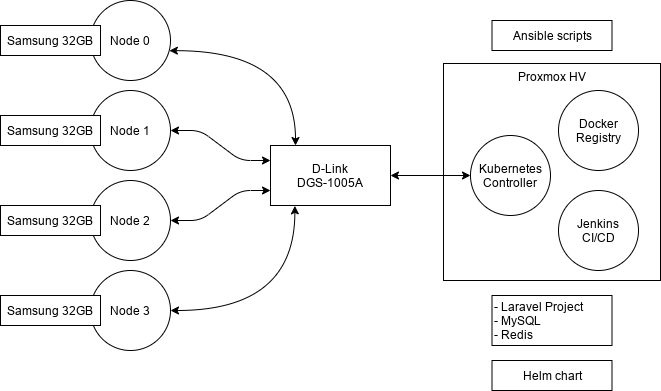

# Kubernetes cluster on ARM nodes (WIP)

Project of simple Kubernetes cluster on ARM nodes.



<!-- toc -->

- [Specifications](#specifications)
- [Installing operation systems](#installing-operation-systems)
  * [Proxmox](#proxmox)
    + [Creating ARM64 VM](#creating-arm64-vm)
    + [Installing Ubuntu to VM](#installing-ubuntu-to-vm)
  * [Installing Ubuntu to NanoPi NEO3](#installing-ubuntu-to-nanopi-neo3)
- [Video blog about this project](#video-blog-about-this-project)

<!-- tocstop -->

## Specifications

Hardware:

- 1x D-Link DGS-1005A/c
- 4x Ethernet cable (with four couper pairs)
- 4x USB Type-C cable
- 4x Power supply adapter 5V/2A for USB devices
- 4x NanoPi NEO3
- 4x MicroSD card 32Gb (by Samsung, the EVO series)
- 1x Proxmox server
- 1x Virtual Machine with ARM64 CPU

Software:

- Operation system on all devices is Ubuntu 20.04 LTS (Focal) for ARM64 CPUs. 
- On VM should be installed `k3s server`.
- On all NanoPis should be installed `k3s agents`.
- All agents and server should work from inside Docker container, for example via docker-compose.
- Deployment of `docker-compose.yml` and other following files should be made via [Ansible](https://www.ansible.com/).

## Installing operation systems

Inside virtual machine on Proxmox and on MicroSD cards of
NanoPi NEO3 will be used Ubuntu 20.04 LTS (Focal).

### Proxmox

Proxmox is a controller of Virtual Machines, more details [here](https://www.proxmox.com/).

#### Creating ARM64 VM 

First download `ubuntu-20.04.1-live-server-arm64.iso` image from:

https://mirror.yandex.ru/ubuntu-cdimage/ubuntu/releases/20.04.1/release/

Then will need to create VM with EFI support, all other parameters
can be saved in default state, but will need to attach ISO image
and probably change size of HDD, from 32Gb to something more larger.

Then need to `Hardware` tab and delete EFI partition, then
click to `Add` button and create `EFI` drive again.
It looks insane, but by some reason Proxmox for EFI VMs each time
want to create 128Kb drive, which trigger error like:
`qemu-system-aarch64: device requires 67108864 bytes, block backend provides 131072 bytes`
on VM boot stage.

This message mean what for VM need 64Mb drive for EFI.

For enabling ARM64 emulation need after creating via
web-interface open a configuration file ov VM
(for example ID of VM will be 110). This configuration can be found
in following folder: `/etc/pve/nodes/vm/qemu-server`.

```shell script
sudo mcedit /etc/pve/nodes/vm/qemu-server/110.conf
```

Then need add missed fields, for example will need to add at least `arch: aarch64`, 
then need to remove string like: `vmgenid: 0000000000000000000`.

Example configuration:

```
arch: aarch64
bios: ovmf
boot: dcn
bootdisk: scsi0
cores: 1
efidisk0: local:vm-110-disk-1,size=64M
memory: 2048
name: k3s-server
net0: virtio=00:00:00:00:00:00,bridge=vmbr0,firewall=1
numa: 0
ostype: l26
scsi0: local:vm-110-disk-0,size=40G
scsi1: local:iso/ubuntu-20.04.1-live-server-arm64.iso,media=cdrom,size=881M
scsihw: virtio-scsi-pci
serial0: socket
smbios1: uuid=ffffffff-ffff-ffff-ffff-ffffffffffff
sockets: 1
vga: serial0
```

#### Installing Ubuntu to VM

Then need to start VM and open `xterm.js` console, because default `noVNC`
not able for work with VGA via serial port (each press to any key will send Enter to VM).

After Ubuntu started just wait some time (booting may take about 10-20 minutes),
then follow installation instruction.

When installation is almost done and you see `Security Updates` stage click to
`Cancel`, because by some reason VM stuck on this stage (open status tab, you'll
see 100% of CPU and memory usage). 

After installation Ubuntu should receive IP address via DHCP, and you may finally login.

> BTW: Full path from start to end of installation may take about couple hours, so do not worry and just be patient.

### Installing Ubuntu to NanoPi NEO3

First download `Armbian_20.08.1_Nanopineo3_focal_current_5.8.6_minimal.img.xz` archive from:

https://www.armbian.com/nanopineo3/

Then extract an archive:

```shell script
xz -d Armbian_20.08.1_Nanopineo3_focal_current_5.8.6_minimal.img.xz
``` 

Then connect MicroSD card and check name of device:

```shell script
~$ sudo fdisk -l | grep 'model: Micro' -A 10 -B 2

Disk /dev/sdX: 29,81 GiB, 32010928128 bytes, 62521344 sectors
Disk model: Micro SD        
Units: sectors of 1 * 512 = 512 bytes
Sector size (logical/physical): 512 bytes / 512 bytes
I/O size (minimum/optimal): 512 bytes / 512 bytes
Disklabel type: dos
Disk identifier: 0x0000000
``` 

`/dev/sdX` is a device name of connected Micro SD card, your probably will be different.

Flash the image to this card:

```shell script
dd if=Armbian_20.08.1_Nanopineo3_focal_current_5.8.6_minimal.img of=/dev/sdX bs=1024k status=progress
``` 

Then wait some time.

> By default, size of created partition is about 800Mb, try to use `gparted` for increasing space to 32Gb

After flashing, you may connect a card to NanoPi NEO3, then turn on the device.

In a few seconds device will receive and IP address if you have DHCP server in your network,
try to [connect via SSH](https://docs.armbian.com/User-Guide_Getting-Started/#how-to-login).

* Username: `root`
* Password: `1234`

After first login NanoPi's promt will ask you about a new password and some other things.

NanoPi is ready for usage, congrats :)

## How to deploy k3s

Here will be described part about installing additional tools to controller and nodes, plus about deploy
of docker-compose configs to machines.

First need to install ansible tool via package manager:

```
sudo apt-get install ansible
```

All commands below will be executed in `ansible` subfolder: 

```
cd ansible
```

All hosts and groups described in `inventory` file:

```
cat inventory
``` 

### Deploy SSH keys (optional)

> playbook-ssh.yml

If you want you can deploy to all machines of cluster `authorized_keys` file:

``
ansible-playbook -i inventory playbook-ssh.yml -e ansible_password=password
``

### Install all required packages on all servers

It's a default playbook, steps descrbed in this file should be execute on all
machines of cluster.

```
ansible-playbook -i inventory playbook-default.yml --ask-become-pass
```

### Deploy k3s server to VM

K3S server is a core of our project, it will execute management operations.

Second servise here is Rancher web-interface.

```
ansible-playbook -i inventory playbook-controller.yml
```

After executing this command API of Kubernetes cluster will be available on https://192.168.1.199:6443

Rancher web-interface will be available here https://192.168.1.199

### Deploy k3s agent to nodes

Now we just need add nodes to cluster controller, nodes will connect automatically:

```
ansible-playbook -i inventory playbook-node.yml
```

Then go to Rancher web-interface and look at Nodes tab.

## Video blog about this project

All videos on Russian language.

1. [Introduction and technical description](https://www.youtube.com/watch?v=jXRgqQrbKAo)
2. [Installing operation systems](https://www.youtube.com/watch?v=A4kwBo6eRKE)
3. Installing and using additional tools for automation
4. TBA...
