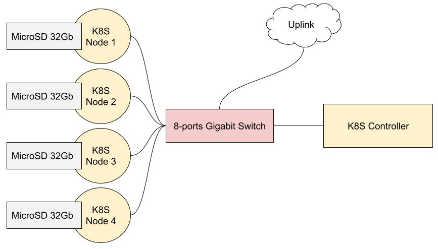

# Kubernetes cluster on ARM nodes (WIP)

Project about simple Kubernetes clusters on ARM nodes.



<!-- toc -->

- [Specifications](#specifications)
  * [Controller](#controller)
  * [Nodes](#nodes)
    + [NanoPi NEO3 based solution](#nanopi-neo3-based-solution)
    + [Raspberry Pi CM3 based solution](#raspberry-pi-cm3-based-solution)
  * [Software](#software)
- [Installing Operating Systems](#installing-operating-systems)
  * [Installing OS to NanoPi NEO3](#installing-os-to-nanopi-neo3)
  * [Installing OS to Raspberry Pi CM3](#installing-os-to-raspberry-pi-cm3)
- [Deploying K3S with help of Ansible](#deploying-k3s-with-help-of-ansible)
  * [Install all required packages on all servers](#install-all-required-packages-on-all-servers)
  * [Deploy k3s server to controller](#deploy-k3s-server-to-controller)
  * [Deploy k3s agent to nodes](#deploy-k3s-agent-to-nodes)
  * [Install and configure kubectl](#install-and-configure-kubectl)
- [How to enable Kubernetes Dashboard](#how-to-enable-kubernetes-dashboard)
- [Video blog about this project](#video-blog-about-this-project)
- [Links](#links)

<!-- tocstop -->

## Specifications

Communication between nodes and controller:

- 1x [Mercusys MS108G](https://www.mercusys.com/en/product/details/ms108g)

### Controller

- 1x Ethernet cable (with four copper pairs)
- 1x USB Type-C cable
- 1x Power supply adapter 5V/2A for USB devices
- 1x Raspberry Pi 4B (CPU: quad-core, RAM: 8Gb)
- 1x MicroSD card 32Gb (by Samsung, the EVO series)

### Nodes

#### NanoPi NEO3 based solution

- 4x Ethernet cable (with four copper pairs)
- 4x USB Type-C cable
- 4x Power supply adapter 5V/2A for USB devices
- 4x [NanoPi NEO3](https://www.friendlyelec.com/index.php?route=product/product&product_id=279) (CPU: quad-core, RAM: 2Gb)
- 4x MicroSD card 32Gb (class 10)

#### Raspberry Pi CM3 based solution

- 2x Ethernet cable (with four copper pairs)
- 1x Power supply adapter 12V/5A for TuringPi board
- 1x [TuringPi V1](https://turingpi.com/v1/) cluster board
- 7x [Raspberry Pi CM3 Lite](https://www.raspberrypi.com/products/compute-module-3/) (CPU: quad-core, RAM: 1Gb)
- 7x MicroSD card 32Gb (class 10)

### Software

- Operating Systems on all devices in Ubuntu 20.04 LTS (or recent) for ARM64 CPUs;
- On controller should be installed `k3s server`;
- On all nodes should be installed `k3s agent`;
- All agents and controller should work from inside Docker container, for example with help of docker-compose;
- Deployment of `docker-compose.yml` and other following files should be made via [Ansible](https://www.ansible.com/).

## Installing Operating Systems

### Installing OS to NanoPi NEO3

On MicroSD cards will be used Ubuntu 20.04 LTS _Focal Fossa_ (or recent).

First download `Armbian_21.08.1_Nanopineo3_focal_current_5.10.60.img.xz` archive from:

https://armbian.hosthatch.com/archive/nanopineo3/archive/

Then extract an archive:

```shell
xz -d Armbian_21.08.1_Nanopineo3_focal_current_5.10.60.img.xz
```

Then connect MicroSD card and check name of device:

```shell
~$ sudo fdisk -l | grep 'model: Micro' -A 10 -B 2

Disk /dev/sdX: 29,81 GiB, 32010928128 bytes, 62521344 sectors
Disk model: Micro SD
Units: sectors of 1 * 512 = 512 bytes
Sector size (logical/physical): 512 bytes / 512 bytes
I/O size (minimum/optimal): 512 bytes / 512 bytes
Disklabel type: dos
Disk identifier: 0x0000000
```

`/dev/sdX` is a device name of connected Micro SD card, your probably will be different.

Flash the image to this card:

```shell
dd if=Armbian_21.08.1_Nanopineo3_focal_current_5.10.60.img of=/dev/sdX bs=1024k status=progress
```

Then wait some time.

> By default, size of created partition is about 800Mb, try to use `gparted` for increasing space to 32Gb

After flashing, you may connect a card to NanoPi NEO3, then turn on the device.

In a few seconds device will receive and IP address if you have DHCP server in your network,
try to [connect via SSH](https://docs.armbian.com/User-Guide_Getting-Started/#how-to-login).

* Username: `root`
* Password: `1234`

After first login NanoPi's prompt will ask you about a new password and some other things.

NanoPi is ready for usage, congrats :)

### Installing OS to Raspberry Pi CM3

On MicroSD cards will be used Ubuntu 20.04 LTS _Focal Fossa_ (or recent).

Need to install `rpi-imager` tool:

https://github.com/raspberrypi/rpi-imager

```shell
sudo apt-get install rpi-imager
```

After need to run `rpi-image`, choose Ubuntu Server from **Other general purpose OS** section and select USB flash drive.

You also may preconfigure names of hosts, default login/pass and SSH key in settings of `rpi-imager`, for this just click to **cog** icon.

After you ready click to **Write** button and wait some time.

## Deploying K3S with help of Ansible

Here will be described part about installing additional tools to controller and nodes, plus about deploy
of docker-compose configs to machines.

First need to install ansible tool via package manager:

```shell
sudo apt-get install ansible
```

All commands below will be executed in `ansible` subfolder:

```shell
cd ansible
```

All hosts and groups described in `inventory` file, copy from example, then change to your hosts:

```shell
cp inventory.dist inventory
mcedit inventory
```

Also need to set username with sudo permissions:

```shell
cp vars/user.dist.yml vars/user.yml
mcedit vars/user.yml
```

Don't forget to change path to `id_rsa.pub` public key file.

### Install all required packages on all servers

> playbook-default.yml

It's a default playbook, steps described in this file should be executed on all
machines of cluster, required sudo privileges.

```shell
ansible-playbook -i inventory playbook-default.yml --ask-become-pass
```

### Deploy k3s server to controller

> playbook-controller.yml

K3S server is a core of our project, it will execute management operations.

Second service here is Rancher web-interface.

```shell
ansible-playbook -i inventory playbook-controller.yml
```

After executing this command API of Kubernetes cluster will be available on https://192.168.1.200:6443

### Deploy k3s agent to nodes

> playbook-node.yml

Now we just need add nodes to cluster controller, nodes will join to cluster automatically:

```shell
ansible-playbook -i inventory playbook-node.yml
```

### Install and configure kubectl

Instruction related to your OS [is here](https://kubernetes.io/docs/tasks/tools/).

Need to change directory to `~/.kube` and download kubeconfig from k8s-controller:

```shell
[ -d ~/.kube ] || mkdir ~/.kube
cd ~/.kube
cp config config.bak
scp k8s-controller:/home/pasha/k3s-controller/output/kubeconfig.yaml config
```

Test installation:

```shell
kubectl get nodes
```

In result will be something like this:
```text
NAME             STATUS   ROLES                  AGE   VERSION
k8s-node4        Ready    <none>                 31m   v1.22.11+k3s2
k8s-node2        Ready    <none>                 31m   v1.22.11+k3s2
k8s-node3        Ready    <none>                 31m   v1.22.11+k3s2
k8s-node1        Ready    <none>                 31m   v1.22.11+k3s2
k8s-node6        Ready    <none>                 31m   v1.22.11+k3s2
k8s-node7        Ready    <none>                 30m   v1.22.11+k3s2
k8s-node5        Ready    <none>                 31m   v1.22.11+k3s2
k8s-controller   Ready    control-plane,master   32m   v1.22.11+k3s2
```

## How to enable Kubernetes Dashboard

Go to folder with dashboard installation scripts: 

```shell
cd k8s-dashboard
```

Run `install.sh` then wait couple minutes, after script is done run following command:

```shell
kubectl -n kubernetes-dashboard port-forward svc/kubernetes-dashboard  9090:80
```

Then open http://localhost:9090 in browser.

## Video blog about this project

All videos on Russian language.

1. [Introduction and technical description](https://www.youtube.com/watch?v=jXRgqQrbKAo)
2. [Installing operating systems](https://www.youtube.com/watch?v=A4kwBo6eRKE)
3. [Deploy K3S with help of Ansible](https://www.youtube.com/watch?v=u_AuOKlqTNw)
4. [Moving controller to Raspberry Pi 4B](https://www.youtube.com/watch?v=KBxG_zOksbY)
5. Kubernetes Dashboard and GoCD server with agents in Kubernetes
6. TBA...

## Links

* [Note about Proxmox and ARM virtual machine](PROXMOX.md)
* https://medium.com/@tejaswi.goudru/disable-authentication-https-in-kubernetes-dashboard-2fada478ce91
